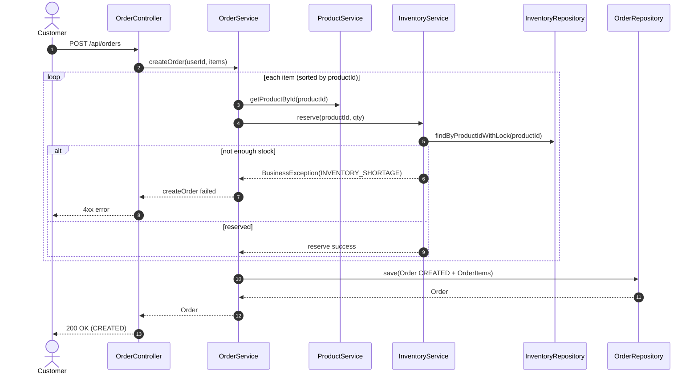
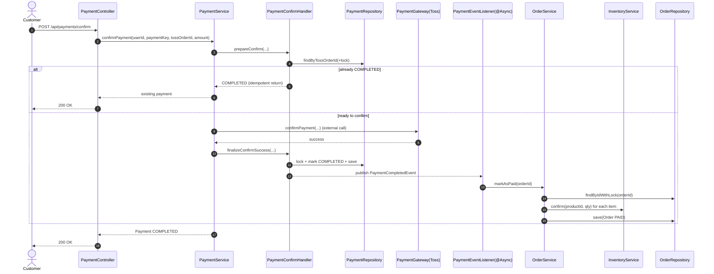
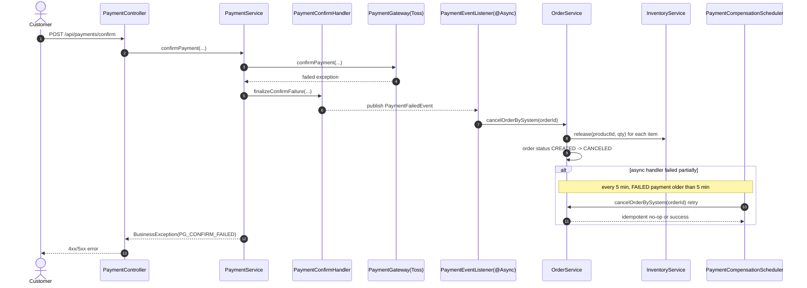
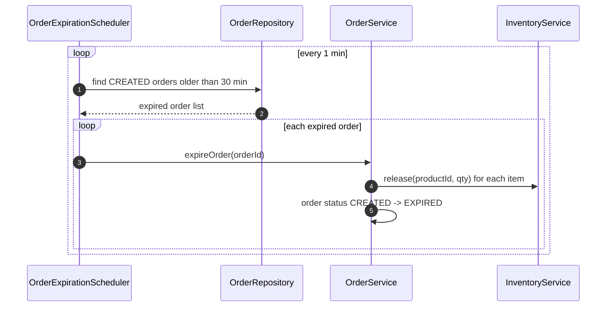
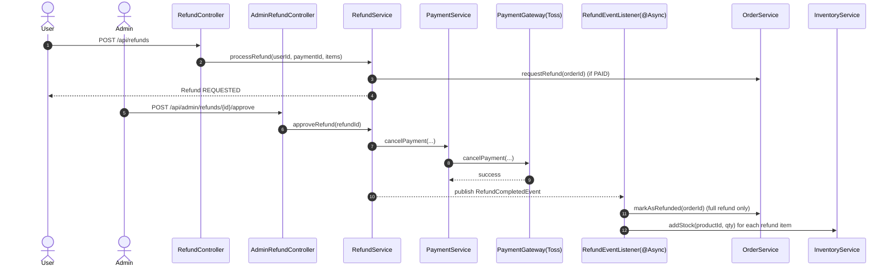
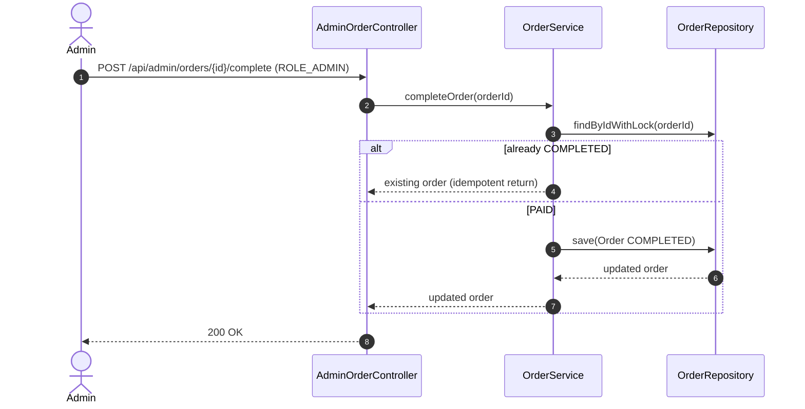

# Use Case Sequence Diagrams (Text)

This document captures the current implementation flow as Mermaid `sequenceDiagram` text.

## 1) Create Order (reserve success/failure)

## 2) Confirm Payment Success (idempotent, async paid transition)

## 3) Confirm Payment Failure (reserve release compensation)

## 4) Reserve Timeout Auto Release (30 min)

## 5) Refund Flow (request -> admin approve -> stock restore)

## 6) Admin Order Completion (delivery complete)

## Notes

- Event transport is currently Spring `ApplicationEvent` + `@Async`, not DB Outbox.
- Payment completion path is idempotent at both payment and order transition levels.
- Reserve is not indefinite: it is released by `OrderExpirationScheduler` after 30 minutes (for `CREATED` orders).
